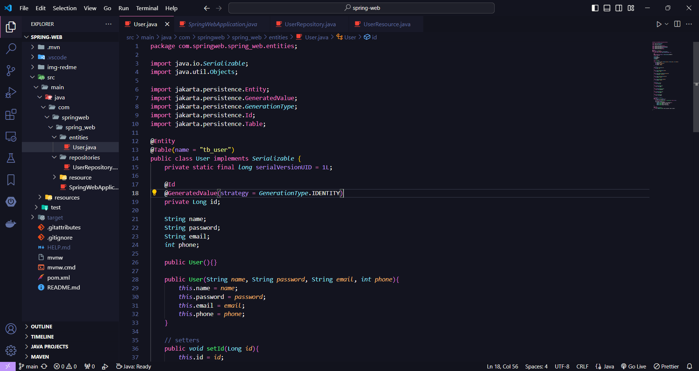

# Projeto portfolio spring web☕



> Lorem

## Requisitos 💻

Antes de clonar o projeto e recomendado você ter os seguintes requisitos:

-   Necessario ter `java` instalado
-   Requisito `git` para clonar
-   Sua maquina `Windows, Linux ou Mac`.
-   Necessario uma `IDE`
-   Conhecimento basico `Api`

## Tecnologias 🚀

As principais tecnologias e ferramentas utilizadas neste projeto são:

-   `java`: linguagem de programação de alto nível, orientada a objetos, e amplamente utilizada em diversos setores, desde desenvolvimento web e mobile até aplicações corporativas e sistemas embarcados.
-   `Spring`: uma plataforma popular e poderosa para o desenvolvimento de aplicações especialmente no backend. Ele facilita a criação de sistemas robustos e escaláveis, fornecendo uma infraestrutura que simplifica tarefas comuns, como injeção de dependências, segurança, acesso a banco de dados e desenvolvimento web.

## Como instalar 🚀

Windows, Linux e macOS

```
git clone https://github.com/danielBRTanimacao/portfolio-projeto-spring.git

cd spring-web
```

### Contato 📞

-   Nome: Daniel Tenório
-   Email: danieltenorio2046@gmail.com
-   LinkedIn: [Meu LinkedIn](https://www.linkedin.com/in/daniel-tenório-6471b0244/)

<p align="center">Estudo feito com ❤️ por <strong>MIM :)</strong></p>
